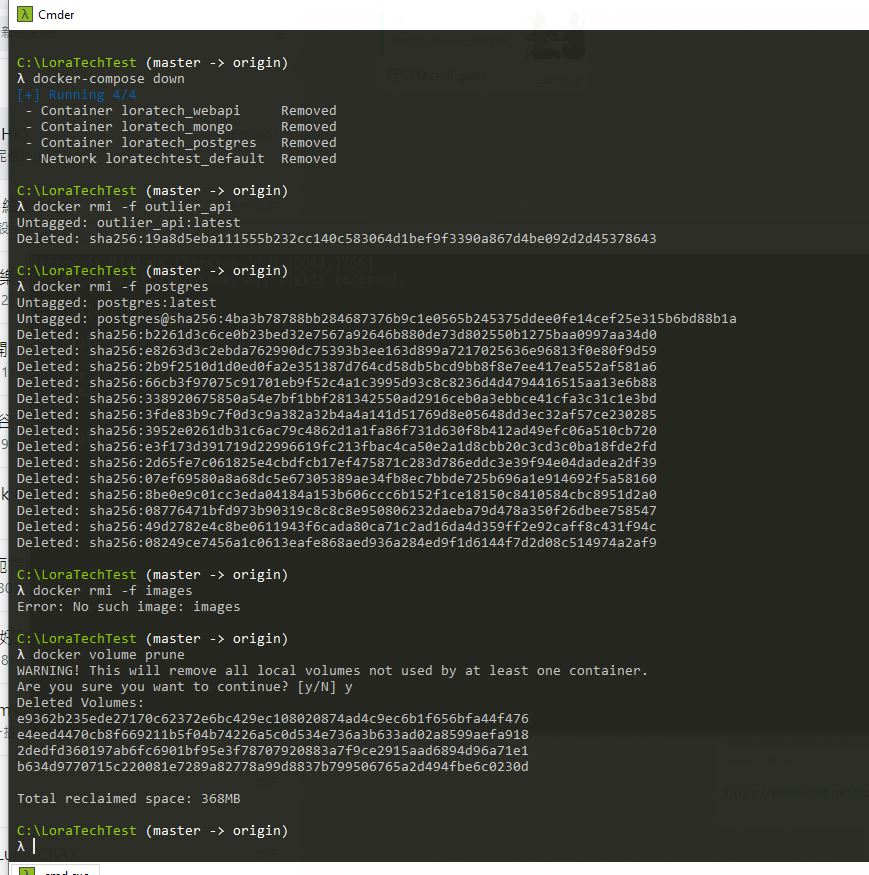

# Lora stock code outperformer

<ins><h2>Introduction</h2></ins>

The question is finding out any outlier stocks during 2020 with distinctive and higher prices in comparing the total_return_index with current year HSI. This workshop a python DbReader program is to fetch out the year 2020 data price ticks and creates the outperformer table in tri_return to show those stock items which is out perform (tri_return > tri_return of HSI) or lower. All the source code can be running either windows or Linux.

The application <b>gendata.py</b> will able to compare the HSI tri_return in 1-12 months and iterating each stock with all 12 months of the year 2020 to justify the outlier which is high (true) or low (false). As given by the question, the tri_return rate is calculated by a last day of month end/ last day of last month end -1 basis.

By running this <b>gendata.py</b> python script, I can altogether to render “postgres_mktoutlier.sql” for PostgresSQL DB and “mongo_mktoutlier.json” for Mongo DB.

By the Docker cp and insert, The Docker PostgresSQL will contain those tri_return data of each stock and they can be queried by another python Flask web service to return a monthly basis stock tri_return list in JSON. And insertMongo.js will be helped to insert those JSON format tri_return data into MongoDB.

<ins><h2>Application and DB deployment</h2></ins>

I have prepared the 3 docker images: loratech_postgres, loratech_webapi, loratech_mongo according to question requirements. For the first step we should need to create a folder (e.g. LoraTechTest) and git clone all the source codes and data transform scripts in / or c:\\. It will create a LoraTechTest folder.

- <h4>Alter Web API docker database IP</h4>

Next step is to alter the Flask database.ini IP address with current running machine static IP. The machine static IP will help Flask to connect each other Postgres DB containers.

- <h4>Generate DB data script </h4>

Go back to DbReader folder and run python gendata.py. This part is no need to run within docker.

After that, it will print Postgres and Mongo file generated, and you will see additional 2 files mongo_mktoutlier.json and postgres_mktoutlier.sql will be created. 

To place safe, you can diff check the dumpy verify data to check if it has been run correct by diff. You may need to convert as Unix EOL file format if you find difference and running on windows.

- <h4>Docker-compose and build </h4>

Then you can cd ../ and run <b>docker-compose up -d</B> to build the Flask docker image and create Postgres and Mongo DB containers respectively. 

- <h4>Copy the data file to container (Postgres) </h4>

As all the docker containers have been created, before we get started, we need to do some cp jobs to move the data files generated by DbReader into each container /tmp folder. We can type:

<b> docker cp .\DbReader\postgres_tblcreate.sql loratech_postgres:/tmp/    </b>

<b> docker cp .\DbReader\postgres_mktoutlier.sql loratech_postgres:/tmp/   </b>

The outperformer create table and outlier data sql will be ready in loratech_postgres /tmp folder.

- <h4>Copy the data file to container (Mongo) </h4>

As the same, we need to do cp job to move the mongo json file again into container /tmp folder.

<b> docker cp .\DbReader\mongo_mktoutlier.json loratech_mongo:/tmp/  </b> 

<b> docker cp insertMongo.js loratech_mongo:/tmp/insertMongo.js      </b>

The outlier data JSON file and insertMongo js script will also be ready in loratech_mongo /tmp folder. 

- <h4> Create Postgres table and insert data </h4>

By docker exec, we will use the /tmp/postgres_tblcreate.sql to create the outperformer table and also execute the insert statements with /tmp/ postgres_mktoutlier.sql in a BASH shell.

<b> docker exec loratech_postgres psql -U myuser -d mydb -f /tmp/postgres_tblcreate.sql </b>

  

  
<b> docker exec loratech_postgres psql -U myuser -d mydb -f /tmp/postgres_mktoutlier.sql </b>

  

  
We can verify the data container by Postgres DB shell 

<b> docker exec -it loratech_postgres psql -d mydb -U myuser </b> 

  

  
- <h4> Create MongoDB collections data </h4>

We can get into the mongo container in shell and type run mongo and pipe the insertMongo.js execution statement togther. 

<b> docker exec -it loratech_mongo /bin/bash </b> 

  <b> mongo -u root -p example < /tmp/insertMongo.js </b> 

    

We can see all 3424 numbers of records have been inserted and we can get the number by count().
    
- <h4> Execute the Flask Api service </h4>

Finally, as all data content have been prepared by the docker exec script, we will docker run the python flask to query the monthly result.  Before we apply the JSON enquiry, we can do 1 or 2 steps to ensure the Flask web service and Postgres DB connection work.

<b> curl http://localhost:5002/test </b>

<b> curl http://localhost:5002/healthCheck </b>

  
After everything get ready, we can get back the monthly result by month parameter.

We can either use curl or browser to visit http://localhost:5002/outperformers/9

For the error proof, the JSON response will get back the invalid month and empty result if input incorrect month argument.

<ins><h2>Application close and clean</h2></ins>
    
- <h4> Shutdown the containers and clean up </h4>

We can simply type <b> dock-compose down </b> and <b> docker rmi -f <image ID> </b>, <b> docker volume prune </b> to clean up everything in order reset everything.

